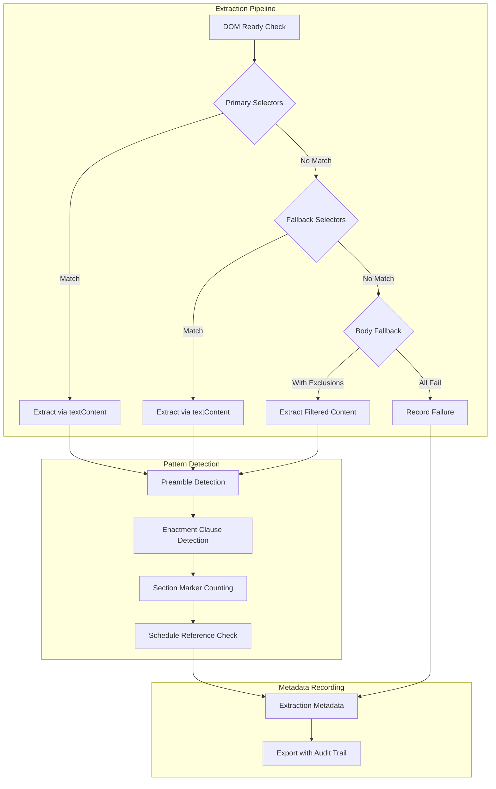

# Design Document: Textual Fidelity & Extraction Alignment

## Overview

This design addresses extraction gaps in the BDLawCorpus extension where browser-rendered pages are fully loaded but legally relevant text segments are omitted due to overly narrow DOM anchoring. The solution implements a hierarchical selector fallback system, Bengali-specific pattern detection, and comprehensive failure classification—all while maintaining strict adherence to the `textContent`-only extraction constraint and research integrity rules.

The core principle is: **selector mismatch ≠ content absence**. A page may be visually complete with legal text present, but extraction fails because the configured CSS selector doesn't match the DOM structure. This design fixes that gap without inferring or synthesizing content.

## Architecture



## Components and Interfaces

### 1. SelectorHierarchy Module

Manages the ordered list of CSS selectors for content extraction.

```javascript
/**
 * Selector hierarchy configuration
 * Selectors are tried in order from most specific to most broad
 */
const SelectorHierarchy = {
  // Primary selectors (existing)
  primary: {
    title: ['h1', '.act-title'],
    content: ['#lawContent', '.law-content', '.act-details'],
    meta: ['.act-meta', '.law-header'],
    schedule: ['table.schedule', '.schedule', '#schedule', 'table']
  },
  
  // Fallback selectors (new)
  fallback: {
    content: [
      '.boxed-layout',
      '.content-wrapper',
      '.main-content',
      'article',
      'main',
      '[role="main"]'
    ],
    preamble: [
      '.preamble',
      '.act-preamble',
      '.whereas-section'
    ]
  },
  
  // Body fallback with exclusion blacklist and legal signal requirement
  bodyFallback: {
    selector: 'body',
    exclusions: [
      'header', 'nav', 'footer', 
      '.sidebar', '.navigation', '.menu',
      '.search', '.search-box', '.search-form',
      '.related-links', '.breadcrumb',
      '.copyright', '.disclaimer',
      'script', 'style', 'noscript'
    ],
    // INVARIANT: Body fallback extraction MUST contain at least one legal marker
    // (section marker, preamble, enactment clause, or schedule reference);
    // otherwise, extraction SHALL be classified as content_selector_mismatch.
    requireLegalSignal: true
  }
};
```

### 2. ExtractionResult Interface

Extended result object with failure classification and audit trail.

```javascript
/**
 * Extraction result with comprehensive metadata
 * @typedef {Object} ExtractionResult
 */
const ExtractionResult = {
  // Content fields (existing)
  title: '',
  content: '',
  content_raw: '',
  
  // Extraction metadata (new)
  extraction_metadata: {
    // Selector audit trail
    selectors_attempted: [],        // Array of selectors tried
    successful_selector: null,      // Which selector succeeded
    extraction_method: 'primary',   // 'primary' | 'fallback' | 'body_fallback'
    content_container_selector: '', // Actual selector that matched
    
    // Failure classification
    extraction_success: true,
    failure_reason: null,           // 'content_selector_mismatch' | 'empty_content' | 'dom_not_ready' | 'network_error' | 'unknown'
    all_selectors_exhausted: false,
    
    // Retry tracking
    retry_count: 0,
    max_retries: 3,
    
    // DOM readiness
    dom_readiness: 'ready',         // 'ready' | 'uncertain' | 'not_ready'
    extraction_delay_ms: 0,
    
    // Pattern detection flags
    has_preamble: false,
    preamble_captured: false,
    preamble_start_position: null,
    
    has_enactment_clause: false,
    enactment_clause_captured: false,
    enactment_clause_position: null,
    
    // Schedule tracking
    schedule_reference_count: 0,
    schedule_table_count: 0,
    missing_schedule: false
  },
  
  // Section marker counts (enhanced)
  marker_frequency: {
    dhara_count: 0,              // ধারা markers
    numeral_danda_count: 0,      // Bengali numeral + danda (১৷, ২৷)
    bengali_numbered_sections: 0, // Combined count
    chapter_count: 0,            // অধ্যায় markers
    schedule_count: 0            // তফসিল markers
  }
};
```

### 3. PatternDetector Module

Detects Bengali legal patterns without modifying content.

```javascript
/**
 * Bengali legal pattern definitions
 * Detection only - no content modification
 */
const BengaliLegalPatterns = {
  // Preamble patterns (Requirement 8)
  preamble: {
    start: /যেহেতু/g,                    // "Whereas"
    continuation: /এবং\s*যেহেতু/g,       // "And whereas"
    english: /\bWHEREAS\b|\bWhereas\b/g
  },
  
  // Enactment clause patterns (Requirement 9)
  enactment: {
    primary: /সেহেতু\s*এতদ্বারা\s*আইন\s*করা\s*হইল/g,     // "Be it hereby enacted"
    variation: /এতদ্বারা\s*নিম্নরূপ\s*আইন\s*করা\s*হইল/g, // Variation
    english: /\bBe\s+it\s+enacted\b|\bIT\s+IS\s+HEREBY\s+ENACTED\b/gi
  },
  
  // Bengali numeral + danda section markers (Requirement 10)
  sectionMarkers: {
    // Bengali numerals: ০-৯ (U+09E6 to U+09EF)
    // Danda: ৷ (U+09F7)
    numeralDanda: /[০-৯]+৷/g,
    
    // Multi-digit patterns
    multiDigit: /[০-৯]{2,}৷/g
  },
  
  // Schedule reference patterns (Requirement 3)
  scheduleReference: {
    bengali: /তফসিল/g,
    english: /\bSchedule\b|\bAppendix\b/gi
  }
};
```

### 4. FailureClassifier Module

Classifies extraction failures by reason.

```javascript
/**
 * Content validation for extraction success
 * contentFound is defined as: non-empty textContent containing at least one legal marker or pattern
 * 
 * @param {string} content - Extracted content
 * @returns {boolean} True if content contains legal signal
 */
function hasLegalSignal(content) {
  if (!content || content.trim() === '') {
    return false;
  }
  
  // Check for any legal marker or pattern
  const legalPatterns = [
    /ধারা/,                           // Section marker
    /অধ্যায়/,                         // Chapter marker
    /তফসিল/,                          // Schedule marker
    /[০-৯]+৷/,                        // Bengali numeral + danda
    /যেহেতু/,                         // Preamble start
    /সেহেতু\s*এতদ্বারা/,              // Enactment clause
    /\bSection\b/i,                   // English section
    /\bChapter\b/i,                   // English chapter
    /\bSchedule\b/i,                  // English schedule
    /\bWHEREAS\b/i,                   // English preamble
    /\bBe\s+it\s+enacted\b/i          // English enactment
  ];
  
  return legalPatterns.some(pattern => pattern.test(content));
}

/**
 * Failure reason classification
 * @param {Object} context - Extraction context
 * @returns {string} Failure reason code
 */
function classifyFailure(context) {
  const { 
    selectorsAttempted, 
    domReady, 
    networkError,
    contentFound,      // Raw extracted text
    hasLegalContent    // Result of hasLegalSignal(contentFound)
  } = context;
  
  if (networkError) {
    return 'network_error';
  }
  
  if (!domReady) {
    return 'dom_not_ready';
  }
  
  if (selectorsAttempted.length > 0 && !contentFound) {
    // Page loaded, selectors tried, but no match
    return 'content_selector_mismatch';
  }
  
  if (contentFound && contentFound.trim() === '') {
    return 'empty_content';
  }
  
  // Content exists but has no legal signal - treat as selector mismatch
  // (likely captured non-legal content like navigation)
  if (contentFound && !hasLegalContent) {
    return 'content_selector_mismatch';
  }
  
  return 'unknown';
}
```

## Data Models

### Extraction Metadata Schema

```javascript
/**
 * Extended extraction metadata for audit trail
 */
const ExtractionMetadataSchema = {
  // Selector tracking with attempt order
  selectors_attempted: {
    type: 'array',
    items: {
      selector: 'string',
      matched: 'boolean',
      element_count: 'number',
      attempt_order: 'number'  // 0-based index for provable ordering
    }
  },
  
  successful_selector: {
    type: 'string',
    nullable: true
  },
  
  extraction_method: {
    type: 'string',
    enum: ['primary', 'fallback', 'body_fallback']
  },
  
  // Failure classification
  failure_reason: {
    type: 'string',
    enum: ['content_selector_mismatch', 'empty_content', 'dom_not_ready', 'network_error', 'unknown'],
    nullable: true
  },
  
  // Pattern detection
  preamble_detection: {
    has_preamble: 'boolean',
    preamble_captured: 'boolean',
    preamble_start_position: { type: 'number', nullable: true }
  },
  
  enactment_detection: {
    has_enactment_clause: 'boolean',
    enactment_clause_captured: 'boolean',
    enactment_clause_position: { type: 'number', nullable: true }
  },
  
  // Marker frequency (enhanced)
  marker_frequency: {
    dhara_count: 'number',
    numeral_danda_count: 'number',
    bengali_numbered_sections: 'number',
    chapter_count: 'number',
    schedule_count: 'number'
  }
};
```

### Body Fallback Exclusion Configuration

```javascript
/**
 * Exclusion selectors for body fallback
 * These elements are removed from consideration when using body as fallback
 */
const BodyFallbackExclusions = {
  // Structural exclusions
  structural: [
    'header',
    'nav', 
    'footer',
    'aside'
  ],
  
  // Class-based exclusions
  classes: [
    '.sidebar',
    '.navigation', 
    '.menu',
    '.nav-menu',
    '.header-content',
    '.footer-content'
  ],
  
  // Search-related exclusions
  search: [
    '.search',
    '.search-box',
    '.search-form',
    '.search-results',
    '[role="search"]'
  ],
  
  // Auxiliary content exclusions
  auxiliary: [
    '.related-links',
    '.breadcrumb',
    '.breadcrumbs',
    '.copyright',
    '.disclaimer',
    '.social-links'
  ],
  
  // Script/style exclusions
  nonContent: [
    'script',
    'style',
    'noscript',
    'iframe',
    'object',
    'embed'
  ]
};
```


## Correctness Properties

*A property is a characteristic or behavior that should hold true across all valid executions of a system—essentially, a formal statement about what the system should do. Properties serve as the bridge between human-readable specifications and machine-verifiable correctness guarantees.*

Based on the prework analysis of acceptance criteria, the following correctness properties have been identified. Each property is universally quantified and can be validated through property-based testing.

### Property 1: Preamble Pattern Detection Accuracy

*For any* Bengali or English legal text content, if the content contains a preamble pattern ("যেহেতু", "এবং যেহেতু", "WHEREAS", "Whereas"), the extractor SHALL detect it and set `has_preamble: true` with accurate `preamble_start_position` matching the character offset of the first pattern occurrence.

**Validates: Requirements 1.1, 1.2, 8.1, 8.2, 8.3, 8.4, 8.5**

### Property 2: Enactment Clause Pattern Detection Accuracy

*For any* Bengali or English legal text content, if the content contains an enactment clause pattern ("সেহেতু এতদ্বারা আইন করা হইল", "এতদ্বারা নিম্নরূপ আইন করা হইল", "Be it enacted", "IT IS HEREBY ENACTED"), the extractor SHALL detect it and set `has_enactment_clause: true` with accurate `enactment_clause_position` matching the character offset of the pattern.

**Validates: Requirements 1.2, 9.1, 9.2, 9.3, 9.4, 9.5**

### Property 3: Content Raw Immutability After Pattern Detection

*For any* extracted content, the `content_raw` field SHALL remain byte-identical before and after pattern detection (preamble, enactment, section markers). Pattern detection is observation-only and SHALL NOT modify the extracted text.

**Validates: Requirements 1.7, 2.4, 2.5, 8.6, 9.6**

### Property 4: Bengali Numeral+Danda Section Marker Detection

*For any* Bengali text containing numeral+danda patterns (০৷ through ৯৷, including multi-digit like ১০৷, ২৫৷, ১০০৷), the extractor SHALL detect all occurrences and count them in `marker_frequency.numeral_danda_count`. Detection SHALL NOT require the presence of "ধারা" in the text. Marker detection counts raw pattern occurrences and does not imply section boundaries.

**Validates: Requirements 2.1, 2.2, 2.3, 2.6, 10.1, 10.2, 10.3, 10.4**

### Property 5: Marker Count Separation (Dhara vs Numeral+Danda)

*For any* extracted content, the extractor SHALL maintain separate counts for "ধারা" markers (`dhara_count`) and Bengali numeral+danda markers (`numeral_danda_count`). These counts SHALL be independent—content with only numeral+danda patterns SHALL have `dhara_count: 0` and `numeral_danda_count > 0`.

**Validates: Requirements 10.5, 10.6**

### Property 6: Schedule Reference vs Table DOM Distinction

*For any* DOM structure, if text contains "তফসিল" or "Schedule" references but no `<table>` DOM element exists, the extractor SHALL set `missing_schedule: true` and SHALL NOT classify the reference as a `table_schedule` numeric region. The `schedule_reference_count` and `schedule_table_count` SHALL be recorded separately and may differ.

**Validates: Requirements 3.1, 3.2, 3.3, 3.5, 3.6**

### Property 7: Fallback Selector Hierarchy and Audit Trail

*For any* DOM structure where primary selectors fail to match, the extractor SHALL try fallback selectors in defined order. When a fallback selector succeeds, the extractor SHALL record `extraction_method: "fallback_selector"`, `successful_selector` with the matching selector, and `selectors_attempted` array containing all selectors tried (both failed and successful).

**Validates: Requirements 4.1, 4.4, 4.6, 6.2, 6.5, 11.2, 11.7**

### Property 8: Failure Reason Classification Accuracy

*For any* failed extraction, the `failure_reason` SHALL be one of: "content_selector_mismatch", "empty_content", "dom_not_ready", "network_error", "unknown". When `failure_reason` is "content_selector_mismatch", the `selectors_attempted` array SHALL be non-empty. A DOM with visible legal text but no matching selectors SHALL be classified as "content_selector_mismatch", NOT "empty_content".

**Validates: Requirements 4.2, 7.1, 7.2, 7.3, 7.4, 7.5, 7.6**

### Property 9: Body Fallback Content Filtering

*For any* extraction using body as fallback selector, the extracted content SHALL NOT contain text from excluded elements (header, nav, footer, sidebar, search, related-links, copyright, script, style). The exclusion SHALL be applied via selector blacklist before text extraction.

**Validates: Requirements 11.5, 11.6**

### Property 10: Retry Mechanism Correctness

*For any* extraction that fails with "content_selector_mismatch", the extractor SHALL automatically retry with fallback selectors up to the configured maximum (default: 3). When retry succeeds, `retry_count` and `successful_selector` SHALL be recorded. When all retries fail, `all_selectors_exhausted: true` SHALL be set. Retries SHALL NOT occur for failure reasons other than "content_selector_mismatch". Retries SHALL differ only by selector choice or delay timing; retries SHALL NOT alter content processing, filtering rules, or pattern detection logic.

**Validates: Requirements 12.1, 12.2, 12.3, 12.4, 12.5, 12.6**

### Property 11: Extraction Delay Application

*For any* configured extraction delay, the extractor SHALL record `extraction_delay_ms` in metadata matching the configured value. When DOM readiness is uncertain, `dom_readiness: "uncertain"` SHALL be recorded.

**Validates: Requirements 5.2, 5.4, 5.6**

### Property 12: Pattern Detection Metadata Completeness

*For any* extraction result, the metadata SHALL include boolean fields `preamble_captured` and `enactment_clause_captured`. When patterns are detected, `has_preamble` and `has_enactment_clause` SHALL be set to `true`. These fields SHALL always be present (never undefined or null).

**Validates: Requirements 1.5, 1.6, 8.4, 9.4**

## Error Handling

### Selector Mismatch Errors

When primary selectors fail to match any DOM element:
1. Log the failed selector and element count (0)
2. Proceed to fallback selectors in order
3. If all fallback selectors fail, try body fallback with exclusions
4. If body fallback fails, record `failure_reason: "content_selector_mismatch"`
5. Include `selectors_attempted` array in error metadata

### DOM Readiness Errors

When DOM readiness cannot be verified:
1. Record `dom_readiness: "uncertain"` in metadata
2. Proceed with extraction attempt
3. If extraction fails, do NOT assume content is missing
4. Log the uncertainty for audit trail

### Pattern Detection Errors

Pattern detection is observation-only and should not throw errors:
1. If pattern regex fails, log the error and continue
2. Set detection flags to `false` rather than throwing
3. Never modify content_raw regardless of detection outcome

### Retry Exhaustion

When all retry attempts are exhausted:
1. Set `all_selectors_exhausted: true`
2. Record final `retry_count`
3. Include all `selectors_attempted` in metadata
4. Do NOT synthesize or infer content

## Testing Strategy

### Property-Based Testing

Property-based tests will be implemented using **fast-check** (JavaScript PBT library) with minimum 100 iterations per property.

Each property test will:
1. Generate random DOM structures and content
2. Execute extraction
3. Verify the property holds for all generated inputs
4. Tag with: **Feature: textual-fidelity-extraction, Property N: {property_text}**

### Unit Tests

Unit tests will cover:
1. Specific Bengali pattern examples (যেহেতু, সেহেতু এতদ্বারা আইন করা হইল)
2. Edge cases: empty content, single character, maximum length
3. Selector hierarchy order verification
4. Exclusion list completeness for body fallback

### Test Configuration

```javascript
// fast-check configuration
const fcConfig = {
  numRuns: 100,           // Minimum iterations per property
  seed: Date.now(),       // Reproducible with seed
  verbose: true,          // Log counterexamples
  endOnFailure: true      // Stop on first failure for debugging
};
```

### Generator Strategy

Generators will produce:
1. **Bengali legal text**: Random text with/without preamble, enactment, section markers
2. **DOM structures**: Various container hierarchies with/without matching selectors
3. **Schedule scenarios**: Text references with/without table DOM elements
4. **Failure scenarios**: DOMs designed to trigger specific failure reasons
